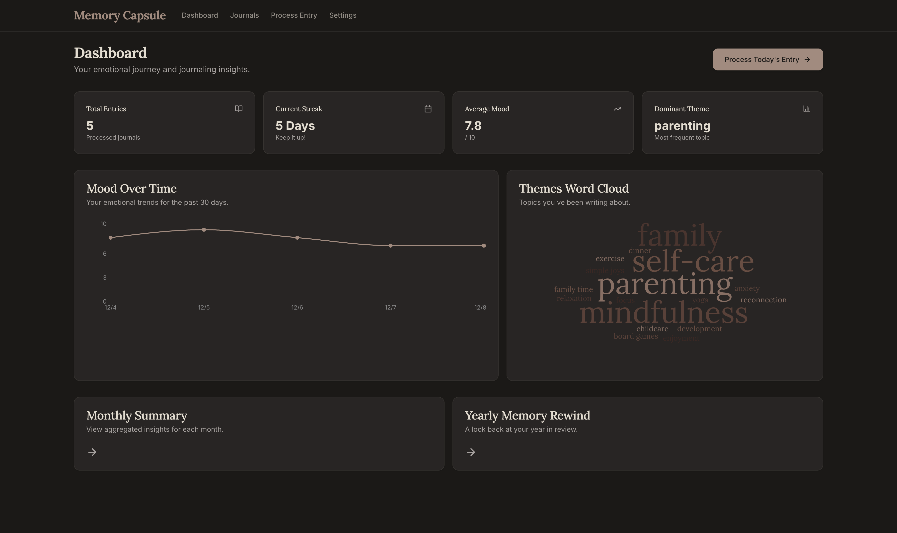

# Memory Capsule Craft 🚀

**Memory Capsule Craft** is a "Private Journaling Cloud" that runs on top of [Craft](https://craft.do) and AI. It transforms your daily Craft journal entries into a rich, insightful dashboard with mood tracking, theme analysis, and automated reflections.



## ✨ Features

- **Seamless Integration**: Write in Craft, view insights on your private dashboard.
- **AI-Powered Analysis**: Automatically extracts summaries, mood scores, emotions, and themes from your entries.
- **Rich Dashboard**: Visualize your journaling habits with:
    - Mood Heatmaps & Charts
    - Word Clouds
    - Streak Tracking
    - Theme Bubbles
- **Private & Secure**: Your data stays in Craft. The app only processes what you choose.
- **Automated Insights**: Get daily reflection prompts and gratitude highlights written back to your Craft doc.

## 🛠️ Tech Stack

- **Framework**: [Next.js 14](https://nextjs.org/) (App Router)
- **Language**: TypeScript
- **Styling**: Tailwind CSS + Shadcn UI
- **CMS/Database**: [Craft API](https://developer.craft.do/)
- **AI**: OpenAI API (GPT-4o / GPT-3.5-turbo)
- **Charts**: Recharts

## 🚀 Getting Started

### Prerequisites

- Node.js 18+ installed.
- A [Craft](https://craft.do) account with API access.
- An [OpenAI](https://openai.com/) API key.

### Installation

1.  **Clone the repository:**

    ```bash
    git clone https://github.com/Lemirq/memory-capsule-craft.git
    cd memory-capsule-craft
    ```

2.  **Install dependencies:**

    ```bash
    npm install
    # or
    bun install
    ```

3.  **Set up Environment Variables:**

    Create a `.env.local` file in the root directory (or use the Settings page in the app to set keys locally in the browser).

    ```env
    # Optional: Pre-configure keys (The app also supports client-side key entry)
    NEXT_PUBLIC_CRAFT_API_KEY=your_craft_api_key
    NEXT_PUBLIC_OPENAI_API_KEY=your_openai_api_key
    ```

4.  **Run the development server:**

    ```bash
    npm run dev
    ```

5.  **Open the app:**
    Navigate to [http://localhost:3000](http://localhost:3000).

## 📖 Usage

1.  **Connect Craft**: Enter your Craft API key in the Settings page.
2.  **Connect AI**: Enter your OpenAI API key.
3.  **Start Journaling**: Create a document in Craft for your daily journal.
4.  **Process Entry**: On the dashboard, click "Process Today's Entry" to analyze your latest writing.
5.  **View Insights**: Watch your dashboard populate with mood trends and insights!

## 📄 License

This project is open-source and available under the [MIT License](LICENSE).

---

Built with ❤️ for the Craft Winter Challenge.
